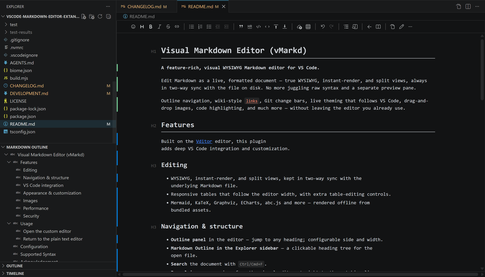
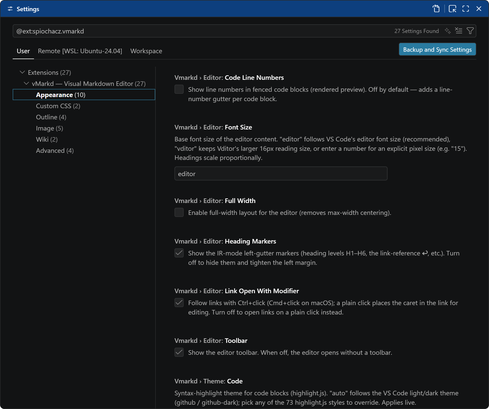

# Visual Markdown Editor (vMarkd)

**A feature-rich, visual WYSIWYG Markdown editor for VS Code.**

Edit Markdown as a live, formatted document — true WYSIWYG, instant-render, and split views, always in two-way sync with the file on disk. No more juggling raw syntax and a separate preview pane.

Outline navigation, wiki-style `[[links]]`, Git change bars, live theming that follows VS Code, drag-and-drop images, code highlighting, and much more — without leaving the editor you already use.

## Features

Built on the [Vditor](https://github.com/Vanessa219/vditor) editor, this plugin adds deep VS Code integration and customization.

### Editing

- WYSIWYG, instant-render, and split views, kept in two-way sync with the
  underlying Markdown file.
- Responsive tables that follow the editor width, with extra table-editing controls.
- Mermaid, KaTeX, Graphviz, ECharts, abc.js and more — rendered offline from
  bundled assets.

### Navigation & structure

- **Outline panel** in the editor — jump to any heading; configurable side and width.
- **Markdown Outline in the Explorer sidebar** — a clickable heading tree for the
  open file.
- **Search** the document with `Ctrl/Cmd+F`.
- **Reveal in source** — jump from the visual editor straight to the matching line
  in the plain-text editor.
- **Wiki-style `[[links]]`** — clickable page links with autocomplete as you type
  `[[`, plus one-click creation of missing pages.

### VS Code integration

- **Follows your VS Code theme**, and re-themes live when you switch.
- **Live settings reload** — config changes apply without reopening the editor.
- **Git change bars** in the gutter (added / modified vs the last commit).
- **Status bar** — estimated reading time, live word count, and the current edit mode.
- **Rename tracking** — the editor follows files moved or renamed in the workspace.
- **Tab-group aware** — no duplicate tabs; open the editor beside your text editor.
- **Opt-in** — never takes over your `.md` files; works in untrusted and virtual
  workspaces.
- One-key return to the plain-text editor (`Ctrl+Alt+E` / `Cmd+Ctrl+E`).

### Appearance & customization

- **Markdown rendering themes** — `auto` matches your VS Code theme's colours, or pick
  a fixed look regardless of the editor theme: **GitHub** (light / dark), **Material
  Dark**, or **VS Code Light / Dark Modern**. Code-block highlighting pairs with the
  chosen theme automatically.
- **Code-block syntax themes** — 73 highlight.js styles, or auto-follow your
  light/dark theme.
- Optional **code-block line numbers**, **heading highlighting** and level markers,
  and an editor **font size** that follows VS Code's.
- **Mermaid diagram themes** — `auto` matches the rendering theme above (e.g. GitHub →
  GitHub, Material Dark → One Dark, VS Code → Zinc), or pick from 15 palettes (Dracula,
  Nord, Tokyo Night, Catppuccin, Solarized, …) or mermaid's built-ins. Diagrams re-theme
  live when you switch.
- **Toolbar visibility** and **full-width layout** toggles.
- **Custom CSS** inline, plus **external CSS files** with live reload.
- **Configurable links** — Ctrl/Cmd+click to open and a plain click to edit (or the
  reverse).

### Images

- Paste, drop, or upload images — saved to a configurable workspace folder.
- Optional **automatic WebP conversion** and **max-width downscaling** to keep files
  small.

### Performance

- **Instant preview on open** — the document appears immediately while the live
  editor loads underneath.
- **Large documents stay responsive** while editing, and very large files stream in
  progressively.

### Security

- Hardened, sandboxed webview, with **remote images off by default** to avoid
  tracking.

See the [changelog](./CHANGELOG.md) for the full list of features and changes.

## Usage

### Open the custom editor

- **Explorer**: right-click a Markdown file → **Open with vMarkd**.
- **Open editor tab**: from a `.md` file, run **Open with…** and pick vMarkd.

### Return to the plain text editor

- Click **Edit In Text Editor** in the editor toolbar, or
- run `vMarkd: Edit in Text Editor` from the Command Palette.
- Switch from WYSYWIG to Source in bottom status bar.

## Configuration

## Acknowledgement

- [zaaack/vscode-markdown-editor](https://github.com/zaaack/vscode-markdown-editor) — the project this fork is based on
- [Vditor](https://github.com/Vanessa219/vditor) — the Markdown editor component
- [Lute](https://github.com/88250/lute) — the Markdown engine (vendored and pinned)
- Rendering & highlighting bundled via Vditor: [highlight.js](https://github.com/highlightjs/highlight.js), [Mermaid](https://github.com/mermaid-js/mermaid), [KaTeX](https://github.com/KaTeX/KaTeX), [ECharts](https://github.com/apache/echarts), [abc.js](https://github.com/paulrosen/abcjs), [Graphviz / Viz.js](https://github.com/mdaines/viz.js), [flowchart.js](https://github.com/adrai/flowchart.js), [markmap](https://github.com/markmap/markmap), [plantuml-encoder](https://github.com/markushedvall/plantuml-encoder), [smiles-drawer](https://github.com/reymond-group/smilesDrawer)
- [github-markdown-css](https://github.com/sindresorhus/github-markdown-css) by Sindre Sorhus (MIT) — the GitHub light/dark markdown-rendering themes (`vmarkd.theme.content`), vendored under `media/markdown-themes/` (upstream verbatim, plus a small marked override block re-asserting the inline-code background on the editor surface)
- [vscode-markdown-style](https://github.com/raycon/vscode-markdown-style) by raycon (MIT) — the Material Dark (One Dark) rendering theme (`vmarkd.theme.content`), adapted under `media/markdown-themes/`
- [Beautiful Mermaid](https://github.com/lukilabs/beautiful-mermaid) by Craft Docs (MIT) — the 15 Mermaid diagram palettes (`vmarkd.theme.mermaid`); only the colour values are vendored (in `src/mermaid-palettes.ts`, translated to mermaid `themeVariables`), not the renderer
- [microsoft/vscode](https://github.com/microsoft/vscode) (MIT) — the `vscode-light-modern` / `vscode-dark-modern` rendering themes use the built-in **Light Modern / Dark Modern** palettes ([`extensions/theme-defaults/themes`](https://github.com/microsoft/vscode/tree/main/extensions/theme-defaults/themes)) + the markdown preview layout ([`extensions/markdown-language-features/media/markdown.css`](https://github.com/microsoft/vscode/blob/main/extensions/markdown-language-features/media/markdown.css))

## License

MIT
