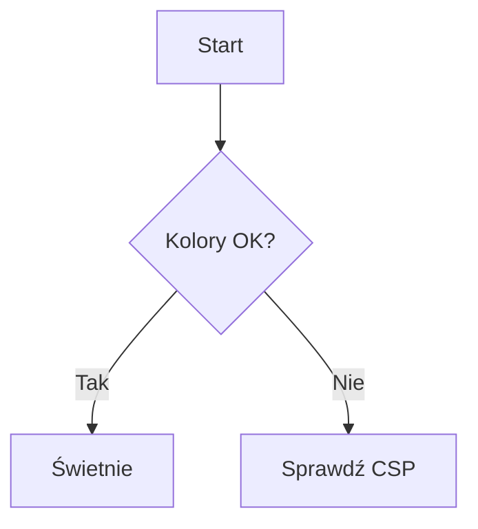

# vMarkd — przykładowy dokument

Krótki dokument do sprawdzania renderowania i **kolorów** (motyw, podświetlanie
składni, tła nagłówków).

## Tekst i formatowanie

Zwykły akapit z **pogrubieniem**, *kursywą*, ~~przekreśleniem~~ oraz `inline code`.
Link do [strony](https://example.com) i odnośnik referencyjny[^1].

> Cytat blokowy — powinien mieć tło z motywu VS Code.
>
> Druga linia cytatu.

[^1]: Definicja przypisu.

## Listy

- Punkt pierwszy
- Punkt drugi
  - Zagnieżdżony
- Punkt trzeci

1. Krok jeden
2. Krok dwa
3. Krok trzy

- [x] Zadanie zrobione
- [ ] Zadanie do zrobienia

## Podświetlanie składni (tu najlepiej widać kolory)

```ts
// TypeScript
interface User {
  id: number
  name: string
}

function greet(u: User): string {
  return `Hello, ${u.name}!` // template literal
}

const admin: User = { id: 1, name: 'Ada' }
console.log(greet(admin))
```

```python
# Python
def fib(n: int) -> int:
    a, b = 0, 1
    for _ in range(n):
        a, b = b, a + b
    return a

print([fib(i) for i in range(10)])
```

```bash
# Bash
for f in *.md; do
  echo "Processing $f"
done
```

```json
{
  "name": "vmarkd",
  "version": "0.3.0",
  "enabled": true
}
```

## Tabela

| Język      | Typowanie | Rok  |
|------------|-----------|------|
| TypeScript | static    | 2012 |
| Python     | dynamic   | 1991 |
| Rust       | static    | 2010 |

## Matematyka (KaTeX)

Inline: $E = mc^2$ oraz $\sum_{i=1}^{n} i = \frac{n(n+1)}{2}$.

Block:

$$
\int_{0}^{\infty} e^{-x^2}\,dx = \frac{\sqrt{\pi}}{2}
$$

## Diagram (mermaid)



---

Koniec. Jeśli bloki kodu są **bez kolorów** (biały/szary tekst), to regresja
podświetlania składni.
